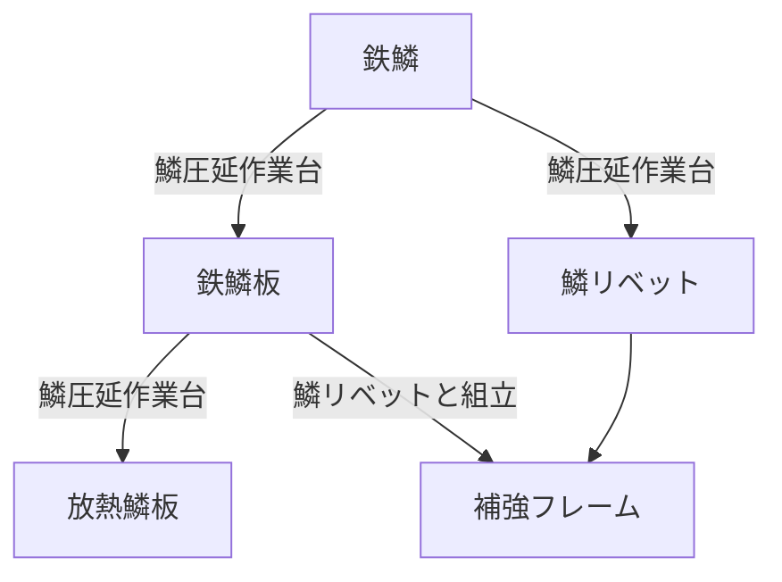
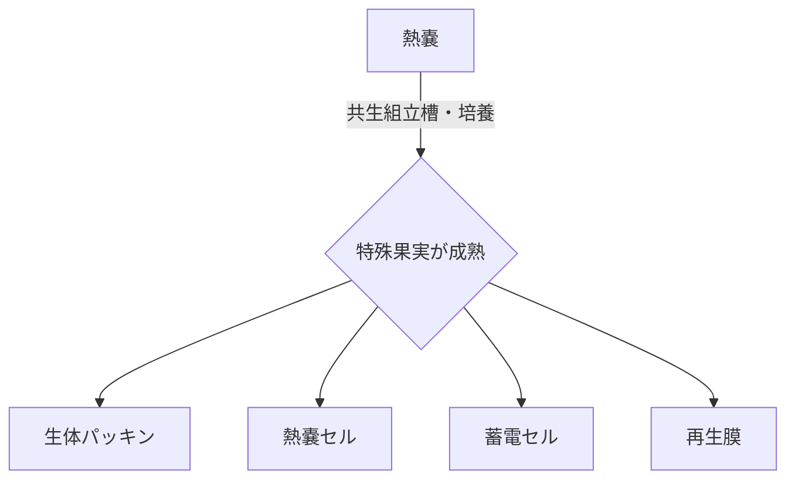
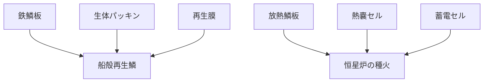
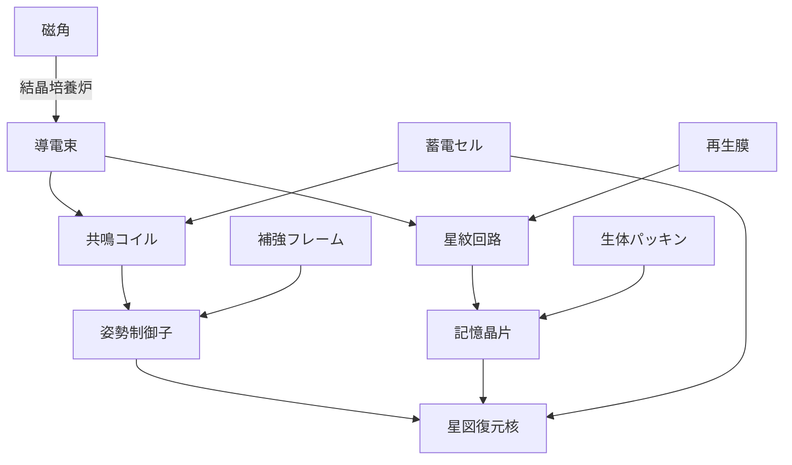
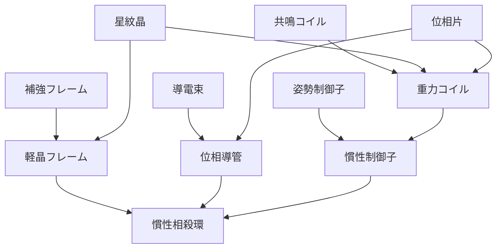
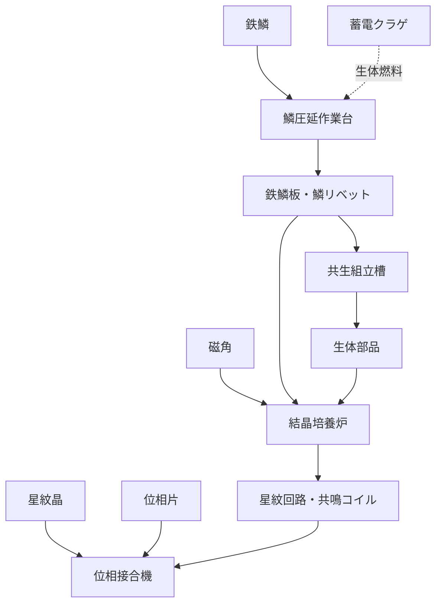

# KomayamaCraft 非食材サプライチェーン設計資料

## 0. ゲーム概要

カジュアルなクリックゲーム。

プレイヤーは惑星に不時着した恒星間航行船を修復し、再び離陸して惑星から脱出することを目標とする。

基本ループは以下。

1. 原生生物・植物・鉱物をクリックして素材を得る
2. 素材から最初の作業台を建設する
3. 作業台で中間部品を作る
4. 中間部品から次の作業台を建設する
5. 採集・燃料供給・搬送を段階的に自動化する
6. 各Tierの宇宙船修復部品を完成させる
7. 新しい採集対象・設備・修復工程を解放する

SFだが現実の工業工程を厳密には再現しない。
名称と見た目はデフォルメする一方、`板`、`リベット`、`セル`、`回路`、`コイル`、`フレーム`など、用途を直感的に想像できる語を残す。

---

# 1. Tier構成

| Tier | 主題 | 新規生素材 | 新規設備 | Tier目標 |
|---|---|---|---|---|
| Tier 1 | 船体の応急修理・補助動力復旧 | 鉄鱗、熱嚢 | 鱗圧延作業台、共生組立槽 | 船殻再生鱗、恒星炉の種火 |
| Tier 2 | 電装・航法復旧 | 磁角 | 結晶培養炉 | 星図復元核 |
| Tier 3 | 離陸・慣性制御 | 星紋晶、位相片 | 位相接合機 | 慣性相殺環 |

生素材はTier 1〜3を通して5種類に抑える。
これとは別に、Tier 1の鱗圧延作業台だけで使用する**燃料生物として蓄電クラゲ**が存在する。蓄電クラゲは加工素材には数えず、生体のまま作業台へ投入する。
新Tierで大量の原料を追加するのではなく、前Tierの中間部品を再利用して工程を広げる。

---

# 2. 採集素材

## 2.1 Tier 1

### 鉄鱗獣 → 鉄鱗

金属質の鱗を持つ原生生物。
クリックして鱗を剥がす、または落ちた鱗を回収する。

**鉄鱗**はTier 1の基礎構造材。
圧延、切断、固定部品化し、Tier 3まで継続して使用する。

### 熱嚢草 → 熱嚢

内部に高温の液体を蓄える植物。
成熟部をクリックすると**熱嚢**を得る。

熱嚢は**燃料には使用しない**。
共生組立槽へ投入する培養素材として使用し、熱嚢草由来の熱によって特殊な実の成熟を促す。

### 蓄電クラゲ

海中に生息する、体内に電荷を蓄える原生生物。
鱗圧延作業台の燃料として、**加工せず生体のまま投入する**。

蓄電クラゲはクラフト用の生素材ではなく燃料枠として扱う。
そのためTier 1〜3の生素材5種類という構成には含めない。

---

## 2.2 Tier 2

### 磁角獣 → 磁角

強い磁性を持つ角を備えた原生生物。

**磁角**は電装系部品の基礎素材。
結晶培養炉によって導電性・共鳴性を持つ人工組織へ変換する。

---

## 2.3 Tier 3

### 星紋晶

地表または地下に成長する、星形の内部模様を持つ結晶。
高密度の情報伝達・重力制御素材として使用する。

### 位相片

空間の揺らぎが固定化した薄片状物質。
位相接合機でのみ安全に加工できる。

位相・重力・慣性系の最終工程に使用する。

---

# 3. サプライチェーン全景

## 3.1 Tier 1：構造材加工

鱗圧延作業台はTier 1の基礎加工設備。
鉄鱗を構造部品へ変換する。

設備は稼働時に**蓄電クラゲを1体ずつ生体燃料として消費する**。
蓄電クラゲは事前加工せず、そのまま燃料スロットへ投入する。

---

## 3.2 Tier 1：共生組立槽の確率培養

共生組立槽は通常の組立機ではなく、**確率出力を持つ培養設備**として扱う。

熱嚢草由来の熱を与えると槽内の共生組織が活性化し、特殊な実が成熟する。
ゲーム上は実そのものを在庫アイテムとして増やさず、収穫時に用途別部品へ変換されたものとして扱う。

初期案の排出確率：

| 出力 | 初期確率 | 役割 |
|---|---:|---|
| 生体パッキン | 40% | 気密・接合 |
| 熱嚢セル | 30% | 高温保持・点火 |
| 蓄電セル | 20% | 電力保持 |
| 再生膜 | 10% | 船体再生・高級生体素材 |

※確率はバランス調整対象。
※将来的にアップグレードで「特定の実が出やすくなる」強化を入れられる。

---

## 3.3 Tier 1：宇宙船修復部品

### 船殻再生鱗

宇宙船の破損した船殻へ貼り付ける生体金属パネル。
再生膜が周囲の船体へ侵食するように広がり、亀裂や破口を塞ぐ。

### 恒星炉の種火

停止した補助動力炉を再点火するための高密度熱源。
Tier 1終了時点では恒星間航行能力までは戻らない。

**船殻再生鱗と恒星炉の種火の両方を船へ投入するとTier 2を解放する。**

---

# 4. Tier 2：結晶培養炉

Tier 2では新しい生素材を**磁角1種類だけ**追加する。

結晶培養炉は、磁角を核として人工的な導電結晶や記憶結晶を育てる設備。
Tier 1の生体部品・構造部品も材料として継続使用する。

## 4.1 製作品

### 導電束

磁角から成長させた細い導電結晶を束ねた配線材。
一般的な「銅線」に相当する基礎電装部品。

### 星紋回路

結晶表面に星形の導電パターンを自己成長させた回路。
Tier 3の生素材「星紋晶」と名称が近いが、こちらは**人工培養された回路パターン**。
星紋晶はこの現象が天然環境で高純度化したもの、という設定にする。

### 共鳴コイル

磁性と蓄電性を利用した電磁部品。
後の重力コイルの前身になる。

### 姿勢制御子

宇宙船の姿勢制御系へ取り付ける小型制御ユニット。
機械的なフレームと共鳴コイルを組み合わせる。

### 記憶晶片

破損した航行記録を一時的に保持・再構成する結晶メモリ。

### 星図復元核

Tier 2の目標部品。
破損した航行データ、現在地、恒星配置を照合し、帰還航路を再構成する。

**星図復元核を宇宙船へ組み込むとTier 3を解放する。**

---

# 5. Tier 3：位相接合機

Tier 3では**星紋晶**と**位相片**を新規採集素材として追加する。

位相接合機は通常の溶接や組立では扱えない素材同士を、位置関係を固定したまま接合する上位設備。

## 5.1 製作品

### 軽晶フレーム

補強フレームへ星紋晶を接合し、強度を維持したまま見かけの質量を減らした構造材。

### 位相導管

位相片を利用し、高エネルギーを通常空間からわずかにずらして通す導管。

### 重力コイル

共鳴コイルを星紋晶・位相片で強化した重力制御部品。

### 慣性制御子

Tier 2の姿勢制御子を拡張し、姿勢だけでなく加速時の慣性そのものを制御するユニット。

### 慣性相殺環

Tier 3の目標部品。
宇宙船の船体周囲へ配置し、離陸および高加速時に船へかかる慣性を低減する。

Tier 3終了時点で、宇宙船は「離陸可能だが恒星間航行能力は未完成」の状態になる。
Tier 4では空間折畳翼・超光速共生炉へ進む想定。

---

# 6. 工程一覧

## 6.1 Tier 1

| ID | 入力 | 設備 | 出力 | 工程上の役割 |
|---|---|---|---|---|
| T1-01 | 鉄鱗 | 鱗圧延作業台 | 鉄鱗板 | 基本構造材 |
| T1-02 | 鉄鱗 | 鱗圧延作業台 | 鱗リベット | 接合材 |
| T1-03 | 鉄鱗板 | 鱗圧延作業台 | 放熱鱗板 | 熱系構造材 |
| T1-04 | 鉄鱗板＋鱗リベット | 鱗圧延作業台 | 補強フレーム | 後続設備・上位構造材 |
| T1-05 | 熱嚢 | 共生組立槽 | 生体パッキン／熱嚢セル／蓄電セル／再生膜 | 確率培養 |
| T1-06 | 鉄鱗板＋生体パッキン＋再生膜 | 共生組立槽 | 船殻再生鱗 | Tier 1目標 |
| T1-07 | 放熱鱗板＋熱嚢セル＋蓄電セル | 共生組立槽 | 恒星炉の種火 | Tier 1目標 |

**鱗圧延作業台は各加工時に蓄電クラゲを燃料として別途消費する。蓄電クラゲは加工せず、そのまま投入する。**

---

## 6.2 Tier 2

| ID | 入力 | 設備 | 出力 | 工程上の役割 |
|---|---|---|---|---|
| T2-01 | 磁角 | 結晶培養炉 | 導電束 | 基礎配線材 |
| T2-02 | 導電束＋蓄電セル | 結晶培養炉 | 共鳴コイル | 電磁・重力系中間材 |
| T2-03 | 導電束＋再生膜 | 結晶培養炉 | 星紋回路 | 制御回路 |
| T2-04 | 共鳴コイル＋補強フレーム | 結晶培養炉 | 姿勢制御子 | 船体制御部品 |
| T2-05 | 星紋回路＋生体パッキン | 結晶培養炉 | 記憶晶片 | 記憶・航法部品 |
| T2-06 | 姿勢制御子＋記憶晶片＋蓄電セル | 結晶培養炉 | 星図復元核 | Tier 2目標 |

---

## 6.3 Tier 3

| ID | 入力 | 設備 | 出力 | 工程上の役割 |
|---|---|---|---|---|
| T3-01 | 補強フレーム＋星紋晶 | 位相接合機 | 軽晶フレーム | 上位構造材 |
| T3-02 | 導電束＋位相片 | 位相接合機 | 位相導管 | 高エネルギー伝送 |
| T3-03 | 共鳴コイル＋星紋晶＋位相片 | 位相接合機 | 重力コイル | 重力制御 |
| T3-04 | 姿勢制御子＋重力コイル | 位相接合機 | 慣性制御子 | 慣性制御 |
| T3-05 | 軽晶フレーム＋位相導管＋慣性制御子 | 位相接合機 | 慣性相殺環 | Tier 3目標 |

---

# 7. 生素材から見た最終到達先

| 生素材 | 主な経路 | Tier 3までの主用途 |
|---|---|---|
| 鉄鱗 | 鉄鱗板／リベット → 補強フレーム | 船殻修復、姿勢制御、軽晶フレーム |
| 熱嚢 | 共生培養 → 生体部品各種 | 蓄電、再生、Tier 2電装 |
| 磁角 | 導電束 → 共鳴コイル／星紋回路 | 航法、姿勢制御、重力制御、位相導管 |
| 星紋晶 | 軽晶フレーム／重力コイル | 慣性相殺系 |
| 位相片 | 位相導管／重力コイル | 慣性相殺系 |

Tier 1の鉄鱗・熱嚢はTier 2以降も間接的に要求される。
蓄電クラゲは鱗圧延作業台を動かす限り継続して必要になる。
そのため新Tier解放後も、初期採集地点と燃料供給を強化・自動化する意味が残る。

---

# 8. 設備建設の供給網

作業台そのものにも前段の加工品を要求し、設備建設を進行確認として利用する。

初期建設コスト案：

| 設備 | 建設入力案 | 意図 |
|---|---|---|
| 鱗圧延作業台 | 鉄鱗 | 最初の原料だけで建設可能にする |
| 共生組立槽 | 鉄鱗板＋鱗リベット | Tier 1の基礎加工を理解したら建設可能 |
| 結晶培養炉 | 補強フレーム＋蓄電セル＋磁角 | Tier 1ラインを維持したままTier 2へ進む |
| 位相接合機 | 星紋回路＋共鳴コイル＋星紋晶＋位相片 | Tier 2加工とTier 3採集の双方を要求 |

具体的な必要個数はゲームテンポ調整時に決める。

---

# 9. 作業台ごとの役割

| 作業台 | 入力 | 出力 | プレイヤーに与える判断 |
|---|---|---|---|
| 鱗圧延作業台 | 鉄鱗、鉄鱗板、燃料の蓄電クラゲ | 板、リベット、放熱板、フレーム | 蓄電クラゲの燃料供給を切らさないか |
| 共生組立槽 | 熱嚢、Tier 1中間材 | 確率生体部品、Tier 1修復部品 | 欲しい特殊果実が出るまで培養するか |
| 結晶培養炉 | 磁角、Tier 1中間材 | 電装・航法部品 | 配線、回路、コイルの生産比率 |
| 位相接合機 | Tier 2部品、星紋晶、位相片 | 重力・慣性部品 | 最終部品へどの中間材を優先するか |

設備ごとの性格を明確に分ける。

- 鱗圧延作業台：燃料管理
- 共生組立槽：確率管理
- 結晶培養炉：中間部品の配分
- 位相接合機：終盤の多段組立

---

# 10. 操作仕様案

| 対象 | 操作 | 消費 | 結果 |
|---|---|---|---|
| 原生生物・植物・鉱物 | クリック | クリック回数・時間 | 素材をドロップ |
| 地面の素材 | クリック／ドラッグ回収 | なし | 所持品へ加算 |
| 作業台建設 | 設備を選択して配置 | 建設素材 | 作業台設置 |
| 鱗圧延作業台 | レシピを選び素材と燃料を投入 | 素材＋蓄電クラゲ | 指定部品を確定生成 |
| 共生組立槽・培養 | 熱嚢を投入 | 熱嚢 | 確率で4種類の生体部品のいずれかを生成 |
| 共生組立槽・組立 | 修復レシピを選択 | 指定中間材 | Tier 1修復部品を確定生成 |
| 結晶培養炉 | レシピを選択 | 指定素材 | 電装・航法部品を生成 |
| 位相接合機 | レシピを選択 | 指定素材 | 重力・慣性部品を生成 |
| 宇宙船 | 完成部品を投入 | Tier目標部品 | 船の見た目と機能が段階的に復旧 |

---

# 11. 自動化の段階

クリックゲームとして、作業そのものを完全になくすのではなく、進行に応じて面倒な部分を順番に自動化する。

### 段階1：手作業

- 採集対象をクリック
- ドロップを回収
- 作業台へ素材投入
- 完成品を回収

### 段階2：採集自動化

- 特定素材の自動採集
- プレイヤーは設備への投入を担当

### 段階3：燃料・搬送自動化

- 鱗圧延作業台への蓄電クラゲ補充
- 作業台間の中間品搬送

### 段階4：生産ライン化

- 同じ作業台を複数配置
- 1台1レシピへ専用化
- 生産量と供給量の不足箇所を増設で解消

自動化の解放そのものを進行報酬として扱う。

---

# 12. 各Tierのプレイヤー体験

## Tier 1

覚える対象を少なくする。

- 鉄鱗を集める
- 熱嚢を集める
- 海から蓄電クラゲを確保する
- 蓄電クラゲを燃料にして鉄鱗を機械加工する
- 熱嚢を共生組立槽へ投入し、特殊な実を培養する
- 船体と補助動力を復旧する

序盤の中心は**加工用の蓄電クラゲを切らさず、鉄鱗加工と共生培養を並行させること**。

## Tier 2

磁角だけを新しく追加する。

Tier 1で作った補強フレーム、蓄電セル、再生膜、生体パッキンが再び必要になるため、旧ラインの増産が必要になる。

中心は**中間部品の配分**。

## Tier 3

星紋晶と位相片を追加。

新素材だけでは完成せず、Tier 1・2の部品も継続使用する。

中心は**複数世代のラインを同時稼働させること**。

---

# 13. 設計上保持する原則

1. **最初の設備は最初の原料だけで建てられる。**
   - 鉄鱗から鱗圧延作業台を建設できる。

2. **序盤から単純な1対1加工だけにしない。**
   - 補強フレームで複数素材レシピを早期に見せる。

3. **確率工程を通常加工から分離する。**
   - 共生組立槽だけが特殊果実の確率培養を担当する。

4. **新設備の建設には前段の出力を使う。**
   - 設備解放が、そのまま前Tierの理解確認になる。

5. **中間部品を複数レシピで共有する。**
   - 補強フレーム、蓄電セル、導電束、共鳴コイルなどを使い回す。

6. **序盤素材を終盤まで失効させない。**
   - 鉄鱗と熱嚢の供給ラインはTier 3でも意味を持つ。

7. **クリック削減を報酬にする。**
   - 採集、燃料、搬送、生産の順に自動化する。

8. **新Tierで生素材を増やしすぎない。**
   - Tier 1：2種
   - Tier 2：1種
   - Tier 3：2種

---

# 14. 現時点での調整項目

以下は仕様確定ではなく、プレイテンポを見て調整する。

| 項目 | 現在案 |
|---|---|
| 鱗圧延作業台の燃料 | 蓄電クラゲ。加工せず生体のまま投入 |
| 共生組立槽の抽選入力 | 熱嚢 |
| 共生組立槽の抽選確率 | 40 / 30 / 20 / 10% |
| 特殊果実そのものの在庫化 | しない。演出上のみ存在 |
| 結晶培養炉の燃料 | なし。復旧した船内電力を使用する想定 |
| 位相接合機の燃料 | なし。復旧した船内電力を使用する想定 |
| Tier 1解放条件 | 船殻再生鱗＋恒星炉の種火を船へ投入 |
| Tier 2解放条件 | 星図復元核を船へ投入 |
| Tier 3終了条件 | 慣性相殺環を船へ投入 |
| 個々のレシピ必要数 | 未定 |
| 自動化設備の名称・レシピ | 未定 |

